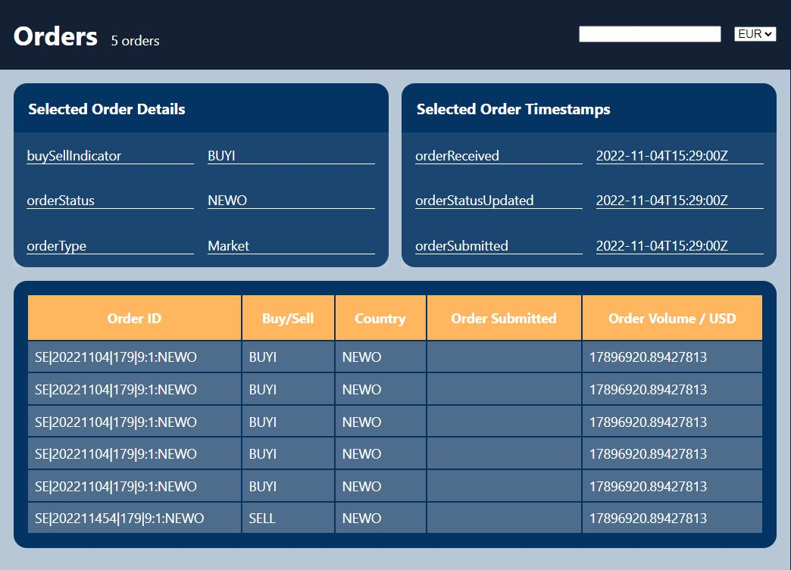

[Live](https://assignment-question-1-master.vercel.app/)

# Instructions

✅ clone this repo and open with your favorite code editor

✅ make sure you are checked out to `master` branch

✅ to run the app `npm install` then `npm start`

## Please fix the following issues

1.  In the title of the header, it displays `5 orders` but there are `6 orders` in the table. We want to display the `total` number of `orders` in the header title

---

- Answer
  <per>

<HeaderTitle
primaryTitle="Orders"
secondaryTitle={`${resultsLength} orders`}
/>

</pre>


2.  In the table order submitted date is missing, we have timestamp data included in the `src\assets\timeStamps.json` with the corresponding ids, please combine that with the order data and make sure the order submitted date is being displayed in the table

---

- Answer

  <per>
      const mergeDataWithTimestamps = () => {
      return mockData.results.map((item) => {
        const matchingTimestamp = timestamps.results.find(
        (timestamp) => timestamp["&id"] === item["&id"]
      );

      if (matchingTimestamp) {
        return {
          ...item,
          orderSubmitted: matchingTimestamp.timestamps.orderSubmitted,
        };
      } else {
        return item;
      }

  });
  };
  const mergedData = mergeDataWithTimestamps();

     </pre>

     <per>
     rows={mergedData
            .map((item, index) => ({
              ...item,
              onClick: () => handleListItemClick(item["&id"]),
            }))}

     </pre>

  

3.  Order Volume cell is displaying USD values, can you please make it display the currency value selected on the dropdown located in the header of the dashboard

---

- Answer
  <per>

  <Dropdown
  options={["GBP", "USD", "JPY", "EUR"]}
  onChange={(e) => setCurrency(e.target.value)}
  selectedItem={currency}
  />

  </pre>

       <per>

  <Dropdown
  options={["GBP", "USD", "JPY", "EUR"]}
  onChange={(e) => setCurrency(e.target.value)}
  selectedItem={currency}
  />

  </pre>

  <per>

// in heading
<ListHeaderCell>Order Volume / {currency}</ListHeaderCell>

     <ListRowCell onClick={row.onClick}>
              {currency === "GBP"
                ? row.bestExecutionData.orderVolume.GBP
                : currency === "JPY"
                ? row.bestExecutionData.orderVolume.JPY
                : currency === "EUR"
                ? row.bestExecutionData.orderVolume.EUR
                : row.bestExecutionData.orderVolume.USD}
            </ListRowCell>

     </pre>

      

4.  Can you please add search feature on the order IDs with the search bar given in the header

---

    - Answer

 <per>
    
  <Search
            value={searchText}
            onChange={(e) => setSearchText(e.target.value)}
          />
           
     </pre>

      <per>

     //In Card component

const filteredRows = rows.filter((row) =>
row["&id"].toLowerCase().includes(searchText.toLowerCase())
);

     </pre>

     <per>

      {filteredRows.map((row, i) => (
          <ListRow key={i}>
            <ListRowCell onClick={row.onClick}>{row["&id"]}</ListRowCell>
            <ListRowCell onClick={row.onClick}>
              {row.executionDetails.buySellIndicator}
            </ListRowCell>
            <ListRowCell onClick={row.onClick}>
              {row.executionDetails.orderStatus}
            </ListRowCell>
            <ListRowCell onClick={row.onClick}>
              {row.orderSubmitted}
            </ListRowCell>
            <ListRowCell onClick={row.onClick}>
              {currency === "GBP"
                ? row.bestExecutionData.orderVolume.GBP
                : currency === "JPY"
                ? row.bestExecutionData.orderVolume.JPY
                : currency === "EUR"
                ? row.bestExecutionData.orderVolume.EUR
                : row.bestExecutionData.orderVolume.USD}
            </ListRowCell>
          </ListRow>
          ))}
    </pre>


5.  Please clear the console errors and warnings.

---

    - Answer


6.  When user selects an order, can you populate the Card on top of the listing component as shown in the image

---

    - Answer




## Bonus

✅ run storybook `npm run storybook`

1. Please add storybook to one of the components

---

- Answer


    <per>

import React from "react";
import { storiesOf } from "@storybook/react";
import Pagination from "../component/pagination/Pagination";

// Define a function to handle page change in your actual app.
const handlePageChange = (pageNumber) => {
console.log("Page changed to:", pageNumber);
};

// Define a Template with args to be used for the 'With Controls' story
const Template = (args) => <Pagination {...args} />;

storiesOf("Pagination", module)
.add("Default", () => (
<Pagination
      currentPage={1}
      pageSize={10}
      totalRecords={100}
      onPageChange={handlePageChange}
    />
))
.add("With Controls", Template.bind({})) // Use the Template
.add("Last Page", () => (
<Pagination
      currentPage={10}
      pageSize={10}
      totalRecords={100}
      onPageChange={handlePageChange}
    />
));

// Add controls for the 'With Controls' story
export const WithControls = Template.bind({});
WithControls.args = {
currentPage: 1,
pageSize: 10,
totalRecords: 100,
onPageChange: handlePageChange,
};

     </pre>


### Extra Added

## Pagination


## -Answer

<List
rows={mergedData
.map((item, index) => ({
...item,
onClick: () => handleListItemClick(item["&id"]),
}))<pre> .slice((currentPage - 1) _ pageSize, currentPage _ pageSize)}</pre>
currency={currency}
searchText={searchText}
/>

<per>```
import React from "react";
import PropTypes from "prop-types";

const Pagination = ({ onPageChange, currentPage, pageSize, totalRecords }) => {
const maxPage = Math.ceil(totalRecords / pageSize);

const onNextClick = () => {
if (currentPage < maxPage) onPageChange(currentPage + 1);
};

const onPreviousClick = () => {
if (currentPage > 1) onPageChange(currentPage - 1);
};

return (

<div style={styles.pagination}>
<button
style={styles.button}
onClick={onPreviousClick}
disabled={currentPage === 1} >
Previous
</button>
<div style={styles.currentPage}>{currentPage}</div>
<button
style={styles.button}
onClick={onNextClick}
disabled={currentPage === maxPage} >
Next
</button>
</div>
);
};

Pagination.propTypes = {
onPageChange: PropTypes.func.isRequired,
currentPage: PropTypes.number.isRequired,
pageSize: PropTypes.number.isRequired,
totalRecords: PropTypes.number.isRequired,
};

const styles = {
pagination: {
display: "flex",
alignItems: "center",
justifyContent: "center",
padding: "10px",
},
button: {
padding: "8px 16px",
margin: "0 5px",
borderRadius: "4px",
border: "1px solid #ccc",
backgroundColor: "#f9f9f9",
cursor: "pointer",
outline: "none",
},
currentPage: {
padding: "8px 16px",
margin: "0 5px",
fontWeight: "bold",
},
};

export default Pagination;

```</per>


```
````
